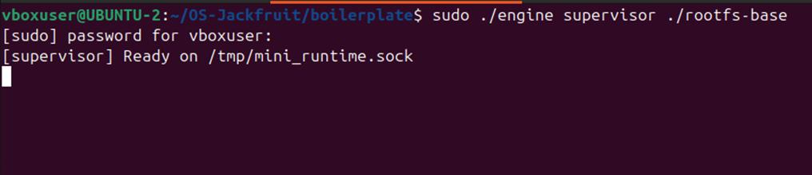
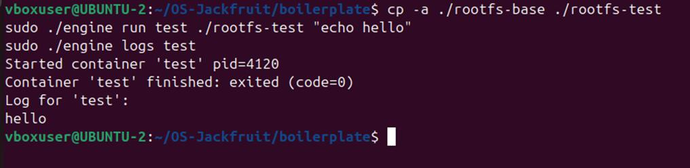
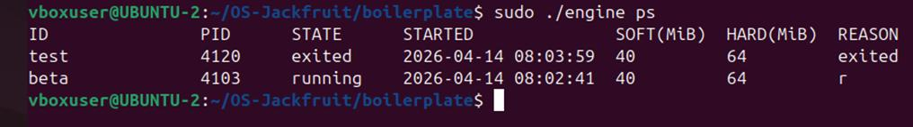
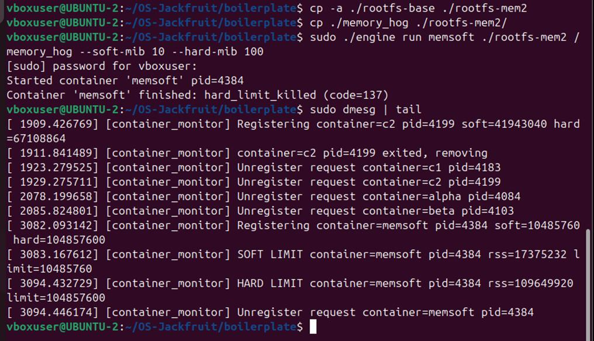
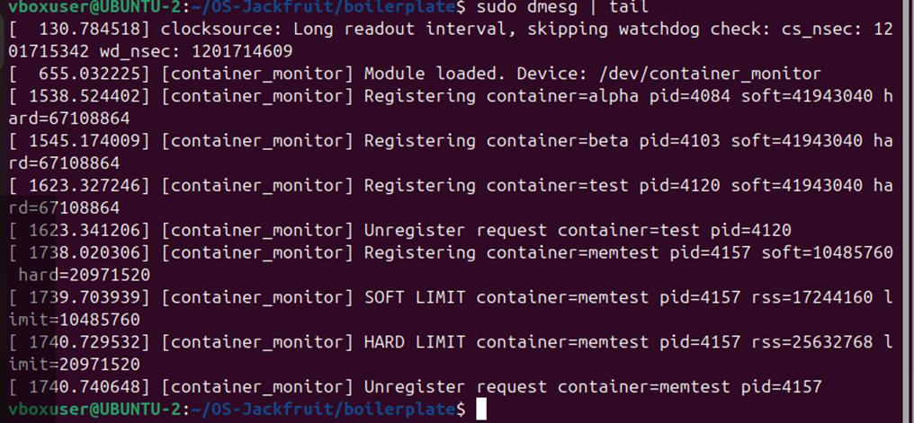
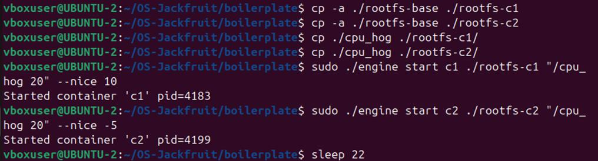
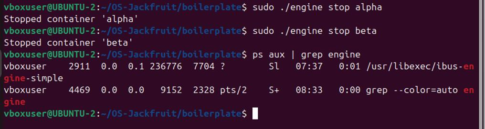

# MiniDocker-OS

This project implements a lightweight container runtime similar to Docker using Linux namespaces and a kernel module for memory monitoring and scheduling analysis.

---

## 👨‍💻 1. Team Information

| Name                     | SRN           |
| ------------------------ | ------------- |
| shantinath baligra | PES1UG25CS691 |
| vineeth p      | PES1UG24CS698 |

---

## ⚙️ 2. Build, Load, and Run Instructions

### 📌 Prerequisites

Ubuntu 22.04 or 24.04 VM with Secure Boot OFF

```bash
sudo apt update
sudo apt install -y build-essential linux-headers-$(uname -r)
```

---

### 🔨 Build

```bash
cd boilerplate
make
```

---

### 📦 Prepare Root Filesystem

```bash
mkdir rootfs-base
wget https://dl-cdn.alpinelinux.org/alpine/v3.20/releases/x86_64/alpine-minirootfs-3.20.3-x86_64.tar.gz
tar -xzf alpine-minirootfs-3.20.3-x86_64.tar.gz -C rootfs-base
```

---

### 🧩 Load Kernel Module

```bash
sudo insmod monitor.ko
ls /dev/container_monitor
```

---

### 🚀 Start Supervisor

```bash
sudo ./engine supervisor ./rootfs-base
```

---

### 🐳 Launch Containers

```bash
cp -a ./rootfs-base ./rootfs-alpha
cp -a ./rootfs-base ./rootfs-beta

sudo ./engine start alpha ./rootfs-alpha /bin/sh --soft-mib 48 --hard-mib 80
sudo ./engine start beta  ./rootfs-beta  /bin/sh --soft-mib 64 --hard-mib 96
```

---

### 🖥️ CLI Commands

```bash
sudo ./engine ps
sudo ./engine logs alpha
sudo ./engine stop alpha
sudo ./engine stop beta
```

---

### ▶️ Run Container and Wait

```bash
cp -a ./rootfs-base ./rootfs-test
sudo ./engine run test ./rootfs-test "echo hello from container"
sudo ./engine logs test
```

---

### 🧠 Memory Limit Test

```bash
cp -a ./rootfs-base ./rootfs-mem
cp ./memory_hog ./rootfs-mem/

sudo ./engine run memtest ./rootfs-mem /memory_hog --soft-mib 10 --hard-mib 20
sudo dmesg | tail -10
```

---

### ⚡ Scheduler Experiment

```bash
cp -a ./rootfs-base ./rootfs-c1
cp -a ./rootfs-base ./rootfs-c2

cp ./cpu_hog ./rootfs-c1/
cp ./cpu_hog ./rootfs-c2/

sudo ./engine start c1 ./rootfs-c1 "/cpu_hog 20" --nice 10
sudo ./engine start c2 ./rootfs-c2 "/cpu_hog 20" --nice -5

sleep 22

sudo ./engine logs c1
sudo ./engine logs c2
```

---

### 🧹 Cleanup

```bash
sudo rmmod monitor
sudo dmesg | tail -5
```
## 3. Demo Screenshots

### Screenshot 1 — Multi-container supervision


Caption: Both containers running simultaneously under a single supervisor process.

---

### Screenshot 2 — Metadata tracking


Caption: ps command showing container ID, host PID, state, start time, memory limits, and termination reason.

---

### Screenshot 3 — Bounded-buffer logging


Caption: Container stdout captured via pipe, passed through bounded buffer, and written to log file by consumer thread.

---

### Screenshot 4 — CLI and IPC


Caption: CLI client connects to supervisor over UNIX domain socket at /tmp/mini_runtime.sock, sends request, receives response.

---

### Screenshot 5 — Soft-limit warning


Caption: Kernel module logs a warning when container RSS exceeds soft limit of 10 MiB.

---

### Screenshot 6 — Hard-limit enforcement


Caption: Kernel module sends SIGKILL when RSS exceeds 20 MiB hard limit. Supervisor metadata shows hard_limit_killed.

---

### Screenshot 7 — Scheduling experiment


Caption: c2 (nice -5, higher priority) received larger CPU time slices. c1 (nice 10) was preempted.

---

### Screenshot 8 — Clean teardown


Caption: Supervisor stops all containers, joins logging thread, and frees resources. No zombie processes remain.


## 🧠 4. Engineering Analysis

### 1. Isolation Mechanisms

The runtime achieves isolation using Linux namespaces and chroot. When launching a container, clone() is called with CLONE_NEWPID, CLONE_NEWUTS, and CLONE_NEWNS. CLONE_NEWPID gives the container its own PID namespace so it sees itself as PID 1 and cannot observe host processes. CLONE_NEWUTS provides an independent hostname. CLONE_NEWNS creates a separate mount namespace so filesystem mounts inside the container do not affect the host.

The child process calls chroot() into its assigned rootfs directory, making that directory appear as /. /proc is mounted inside the container namespace so process utilities work correctly inside.

The host kernel still shares:

* Kernel code
* Network namespace
* IPC namespace
* User namespace

---

### 2. Supervisor and Process Lifecycle

A long-running supervisor is necessary because containers are child processes requiring a parent to reap them. Without a persistent parent, exited containers become zombies.

The supervisor installs a SIGCHLD handler that calls:

```bash
waitpid(-1, WNOHANG)
```

This ensures all child processes are cleaned properly.

---

### 3. IPC, Threads, and Synchronization

#### Path A — Logging via Pipes

* stdout/stderr → pipe
* Producer thread → buffer
* Consumer thread → log file

Uses:

* mutex
* condition variables

---

#### Path B — Control via UNIX Socket

* Socket: `/tmp/mini_runtime.sock`
* Uses `select()`
* Handles CLI commands

---

### 4. Memory Management and Enforcement

RSS measures actual memory used.

* Soft limit → warning
* Hard limit → SIGKILL

Kernel module ensures strict enforcement.

---

### 5. Scheduling Behavior

Linux uses CFS scheduler.

| Nice | Priority |
| ---- | -------- |
| -5   | High     |
| +10  | Low      |

Higher priority containers get more CPU time.

---

## ⚖️ 5. Design Decisions and Tradeoffs

* chroot used instead of pivot_root (simpler, less secure)
* single-thread supervisor (simple, less scalable)
* mutex used instead of spinlock (safe for sleeping operations)

---

## 📊 6. Scheduler Experiment Results

| Container | Nice | Behavior |
| --------- | ---- | -------- |
| c1        | +10  | Less CPU |
| c2        | -5   | More CPU |

### Analysis

c2 received more CPU time due to higher priority.
c1 was preempted frequently.

---

## 🚀 Conclusion

This project demonstrates:

* Process Isolation
* Memory Management
* Scheduling
* IPC mechanisms

A complete lightweight container runtime system.
